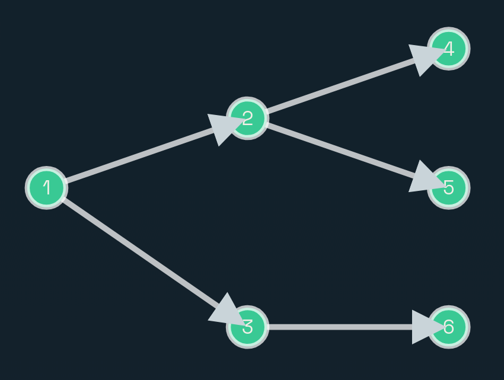
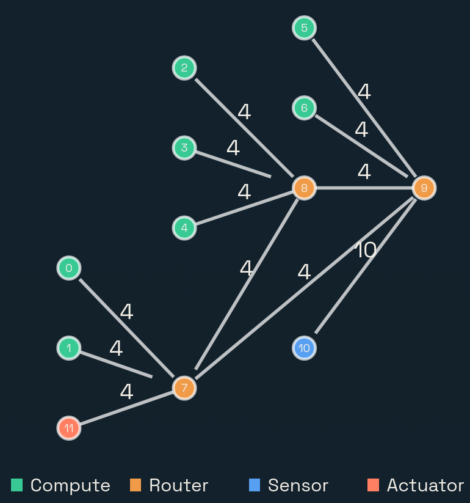

# Lab 2 - Scheduling algorithms for Real Time Systems

## Introduction

Scheduling algorithms are of fundamental importance to the functioning of real-time embedded systems, which are integral to numerous critical applications, including automotive safety systems and healthcare monitoring devices. These systems rely on precise timing and immediate response to external events to function correctly and efficiently. The role of scheduling algorithms is to manage the execution priorities of tasks in a way that optimizes performance and ensures timely task completion. Inadequate scheduling can result in missed deadlines, system overloads, and failures, which in safety-critical systems could have severe consequences. 

Therefore, the application of effective scheduling algorithms is crucial for enhancing system reliability and overall performance. By ensuring that system resources are allocated efficiently and tasks are completed within their time constraints, scheduling algorithms help maintain the integrity and reliability of embedded systems.


*Figure 1: A pool of tasks completed based on scheduling*

## Objective

The primary goal outlined in this task sheet is to design and implement various scheduling algorithms within the context of real-time systems. The visualization frontend will serve as an educational tool, providing visual insights into how different algorithms schedule tasks. You will be able to interact with the application to modify task parameters, compare the outcomes of different scheduling algorithms, and gain a deeper understanding of their advantages and limitations in real-world scenarios.

## Background 

The implementation of scheduling algorithms requires basic knowledge of concepts like graph theory, operations on graphs, the different models used, and so on. This section describes in detail the concepts necessary to implement the scheduling algorithms.

### Application Model

The application model defines how different tasks in a system interact and communicate with each other. It includes the properties of tasks and the messages that are exchanged between them. The tasks are represented by nodes, and in Figure 2, nodes 1, 2, 3, 4, 5, and 6 indicate tasks. The arrows indicate the direction of communication, where one task sends a message to another task. 



*Figure 2: A directed acyclic graph (DAG) shows precedences, showing that process 1 must complete before processes 2 and 3 can be started, etc.*

### Platform Model

The platform model represents the hardware and communication infrastructure of an embedded system. It includes nodes (such as compute units, routers, sensors, and actuators) and links that connect these nodes.

In Figure 3, the arrows between the nodes represent the communication links, with the numbers at the links indicating the link delay. Here, we define that a communication link can only exist between a router and another node, which can either be a compute node, sensor, actuator, or another router. 



Figure 3: Platform model

In multi-node scheduling, the tasks can be distributed across different compute nodes. They can be scheduled on different compute nodes based on the availability and the communication delays between the nodes. However, the tasks must be scheduled in a way that all precedence constraints are maintained. The communication delays between nodes must also be considered while scheduling the tasks. For this, the delays can be added to the execution time of the tasks while calculating the completion time of the tasks.


## Tasks

- Implement the following [scheduling algorithms](scheduling_algorithms.md) as outlined in the [to-do list](todo.rst). These algorithms should take JSON inputs describing the platform model and application model. The input JSON conforms to the JSON schema defined in the [input JSON schema](README.md#api-input-schema-for-schedule-jobs). They should produce a schedule output that adheres to the JSON schema defined in the [output json schema](README.md#output-schema-for-schedule-jobs).
    - Latest Deadline First Single Node (LDF).
    - Earliest Deadline First Single Node (EDF).
    - Least Laxity Multi Node (LLF).
    - Latest Deadline First Multi-Node.
    - Earliest Deadline First Multi-Node.

- Test your implementation using the provided test cases. The test cases are designed to evaluate the correctness of your scheduling algorithms. Ensure that your implementation passes all the test cases. Run the tests using the following command from the root of the project directory:
  ``` BASH
    pytest
  ```
  To automatically run the tests after each algorithm change, you can run the following command from the project root directory:

  ``` BASH
    pip install pytest-watch
    ptw
  ```
- You can verify your code in [codespace](https://eslab.es.eti.uni-siegen.de/codespace/eslab/estask2).

- For this lab, you can ignore the link delay and bandwidth fields in the platform model. You can assume that the communication between the nodes is instantaneous. There is no bandwidth constraint, and all nodes are connected to a single router. However, as a bonus, you are encouraged to consider the link delays and communication paths as defined in the platform model.


## Documentation and Reporting

As you test and optimize, document your findings. Note down what worked, what did not, and how you adjusted your approach. This documentation will be invaluable for your final report and provides a clear record of your problem solving process. Testing and optimization are as much a part of the learning process as the initial development. They provide insight into the practical challenges and the importance of iterative design.

### Documenting Code

- **Code Comments**: Include comprehensive comments throughout your Python code. Explain the purpose of functions, logic behind critical sections, and meanings of key variables. Use inline comments for complex lines of code to clarify their functionality.

- **Readable Structure**: Organize your code  logically. Group related functionalities into functions or classes and use clear, descriptive names for variables and functions. Ensure your script follows a consistent coding style for ease of reading and maintenance.

### Writing Lab Report

 For detailed lab report formatting and submission instructions, refer to the [report guidelines](ES_Guidelines_for_Lab_report.md).

##### Hand in the report and all necessary working files

- Check for grammar and spelling mistakes before submission.
- The report should be a single document file covering the complete exercise.
- Provide commented programming code/modeling files along with your report (.py files).
- The programs must run without errors.
- Upload the report on [codespace](https://eslab.es.eti.uni-siegen.de/codespace/eslab/estask2)

## Deliverables

- The algorithms.py file with the scheduling algorithm implemented.
- Lab report in PDF format.

## Evaluation Criterion

- Well-structured and logically organized code.
- Comprehensive comments explaining the purpose and logic of the code.
- Quality of the report.
- All tests in [codespace](https://eslab.es.eti.uni-siegen.de/codespace/eslab/estask2) should pass. 
 
## References
- [Introduction to Graph Theory](https://www.baeldung.com/csgraph-theory-intro#8-the-weighted-graph)
- [Basic Components, Shortest path, Search algorithms, Minimum Spanning Tree](https://www.geeksforgeeks.org/transpose-graph/?ref=lbp)
- [Basics of Graph theory](https://medium.com/basecs/a-gentle-introduction-to-graph-theory-77969829ead8)
